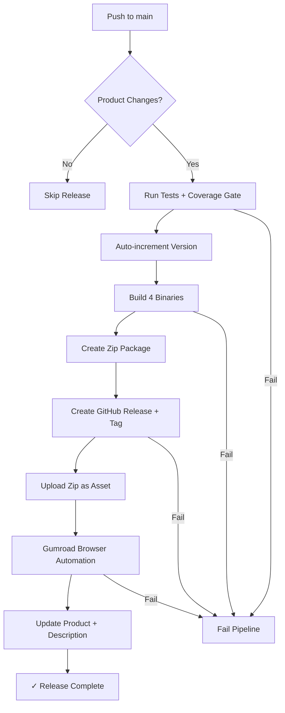

# ScheduleGate Release Process

This document describes the automated release pipeline for ScheduleGate.

## Quick Start

```bash
# Standard release (auto-detect changes, auto-increment version)
/release-pipeline

# Force release (skip change detection)
/release-pipeline --force

# Manual version override
/release-pipeline --version 1.1.0

# Dry-run (build + test only, no publish)
/release-pipeline --dry-run
```

## How It Works

The release pipeline automates the entire process from code changes to product updates:



## Pipeline Stages

### 1. Change Detection

The pipeline checks if any product-impacting files changed since the last release tag.

**Product-impacting paths:**
- `cmd/` — CLI commands
- `internal/` — Core logic
- `desktop/` — Wails GUI
- `main.go` — Entry point
- `Makefile` — Build configuration
- `.github/workflows/` — CI/CD

**Non-triggering paths:**
- Documentation (`*.md`)
- Release scripts (`scripts/`)
- OpenCode config (`.opencode/`)

Use `--force` to skip this check.

### 2. Version Management

Versions follow semantic versioning (semver): `vMAJOR.MINOR.PATCH`

- **Auto-increment**: Bumps the patch version automatically
  - `v1.0.2` → `v1.0.3`
  - `v1.0.9` → `v1.0.10`
- **Manual override**: Use `--version X.Y.Z` to set any version
- **First release**: Defaults to `v1.0.3` (continuing from Makefile VERSION)

### 3. Test Suite

Runs the full test suite with coverage gate:

```bash
go test ./...                    # All tests
go test ./... -coverprofile=...  # With coverage
```

**Coverage gate**: Minimum 55% code coverage required.

### 4. Binary Builds

Four binaries are compiled:

| Binary | Platform | Architecture | Notes |
|--------|----------|--------------|-------|
| `schedulegate` | macOS | arm64 | Apple Silicon |
| `schedulegate.exe` | Windows | amd64 | x86_64 |
| `schedulegate-linux` | Linux | amd64 | x86_64 |
| `schedulegate-gui` | macOS | arm64 | Desktop GUI (CGO) |

**Build flags:**
- `-trimpath` — Reproducible builds
- `-ldflags "-s -w"` — Strip debug info (smaller binaries)
- Version metadata injected via ldflags

### 5. Zip Package

All binaries are packaged into a single zip file:

```
schedulegate-v1.0.3.zip
├── schedulegate           # macOS CLI
├── schedulegate.exe       # Windows CLI
├── schedulegate-linux     # Linux CLI
├── schedulegate-gui       # macOS Desktop GUI
├── README.txt             # Installation guide
├── LICENSE                # AGPLv3 License (dual-licensed: see LICENSE-COMMERCIAL)
└── LICENSE-COMMERCIAL     # Commercial License terms
```

### 6. GitHub Release

A new GitHub Release is created with:

- **Tag**: `vX.Y.Z` (annotated tag)
- **Title**: "ScheduleGate vX.Y.Z"
- **Description**: Auto-generated release notes
- **Asset**: Zip file with all binaries

### 7. Gumroad Update

The Gumroad product page is updated via browser automation:

1. Login to Gumroad
2. Navigate to product edit page
3. Upload new zip file (replaces old version)
4. Replace product description with latest release notes
5. Save/publish changes

## Prerequisites

### For Local Execution

- **Go**: 1.21+ (for building binaries)
- **Node.js**: 22+ (for Desktop GUI frontend)
- **Git**: With push access to repository
- **Playwright**: Available via opencode session

### For GitHub Actions

- **GitHub Token**: Automatically provided (for creating releases)
- **Gumroad Credentials** (optional): Store as GitHub Secrets for full automation

## Configuration

### Environment Variables

| Variable | Purpose | Required |
|----------|---------|----------|
| `GUMROAD_EMAIL` | Gumroad login email | Optional (can prompt) |
| `GUMROAD_PASSWORD` | Gumroad login password | Optional (can prompt) |
| `GUMROAD_PRODUCT_URL` | Product page URL | Optional (has default) |

### GitHub Secrets

For fully automated releases (no prompts), add these to your repository secrets:

1. Go to Settings → Secrets and variables → Actions
2. Add:
   - `GUMROAD_EMAIL`
   - `GUMROAD_PASSWORD`
   - `GUMROAD_PRODUCT_URL` (optional)

## Manual Release

If the automated pipeline fails, you can release manually:

### Step 1: Build Locally

```bash
# Build all binaries
make build-all

# Or build individually
make build-mac
make build-windows
make build-linux

# Build Desktop GUI
cd desktop
cd frontend && npm ci && npm run build && cd ..
CGO_ENABLED=1 go build -o bin/schedulegate-gui main.go
```

### Step 2: Create Zip

```bash
bash scripts/release/zip-binaries.sh v1.0.3
```

### Step 3: Create GitHub Release

```bash
# Create and push tag
git tag -a v1.0.3 -m "Release v1.0.3"
git push origin v1.0.3

# Create release with GitHub CLI
gh release create v1.0.3 \
    --title "ScheduleGate v1.0.3" \
    --notes-file /tmp/release-notes.md \
    schedulegate-v1.0.3.zip
```

### Step 4: Update Gumroad

1. Login to https://gumroad.com/login
2. Navigate to your product
3. Upload new zip file
4. Update description (see template in release notes)
5. Save changes

## Troubleshooting

### Tests Fail

```bash
# Run tests locally
go test ./...

# Check coverage
go test ./... -coverprofile=/tmp/coverage.out
go tool cover -html=/tmp/coverage.out
```

Fix failing tests before releasing.

### Build Fails

```bash
# Clean and rebuild
make clean
make build-all

# For Desktop GUI issues
cd desktop
rm -rf node_modules frontend/node_modules
cd frontend && npm ci && npm run build && cd ..
go mod tidy
CGO_ENABLED=1 go build -o bin/schedulegate-gui main.go
```

### GitHub Release Fails

```bash
# Check if tag exists
git tag -l

# Delete tag if needed
git tag -d v1.0.3
git push origin :refs/tags/v1.0.3

# Retry release
gh release create v1.0.3 --title "ScheduleGate v1.0.3" --notes-file /tmp/release-notes.md schedulegate-v1.0.3.zip
```

### Gumroad Update Fails

1. Check credentials are correct
2. Verify product URL is accessible
3. Try manual update via browser
4. Check for Gumroad API changes

**Partial Release**: If Gumroad fails after GitHub Release succeeds, the release exists but Gumroad is stale. Manual update required.

## Release Notes Format

Release notes are auto-generated from git commits:

```markdown
# ScheduleGate v1.0.3

**Release Date:** 2026-08-18
**Commit:** ef4ff26

## What's New

### Features
- feat: add new metric implementation

### Bug Fixes
- fix: resolve issue #5 column validation

### Documentation
- docs: update README with usage examples

## Downloads
- schedulegate — macOS (arm64) CLI
- schedulegate.exe — Windows (amd64) CLI
- schedulegate-linux — Linux (amd64) CLI
- schedulegate-gui — macOS (arm64) Desktop GUI

## Installation
1. Download and extract zip
2. Add folder to PATH
3. Run schedulegate --help
```

## Version History

| Version | Date | Key Changes |
|---------|------|-------------|
| v1.0.3 | 2026-08-18 | Issue #5 fixes, column validation |
| v1.0.2 | — | Previous release |

## Additional Resources

- [AGENTS.md](AGENTS.md) — Project overview and CLI reference
- [GitHub Repository](https://github.com/gjunqueira-sys/ScheduleGate)
- [Gumroad Product](https://junqueira5.gumroad.com/l/schedulegate)

## Support

For issues with the release process:
1. Check troubleshooting section above
2. Review GitHub Actions logs
3. Open an issue on GitHub
