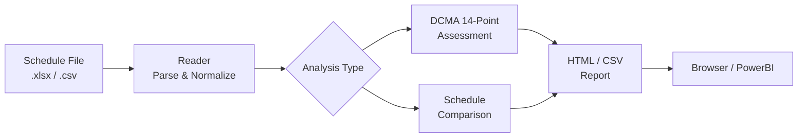
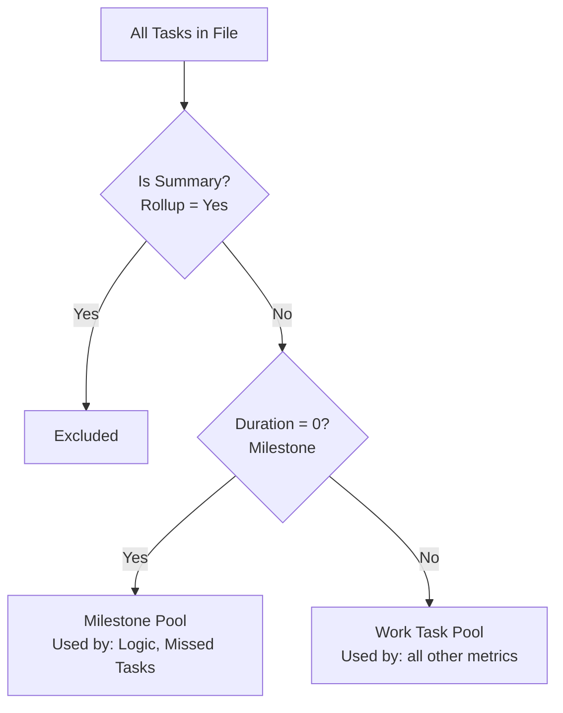
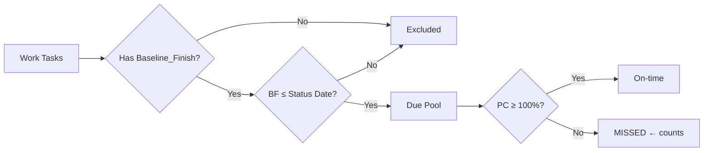
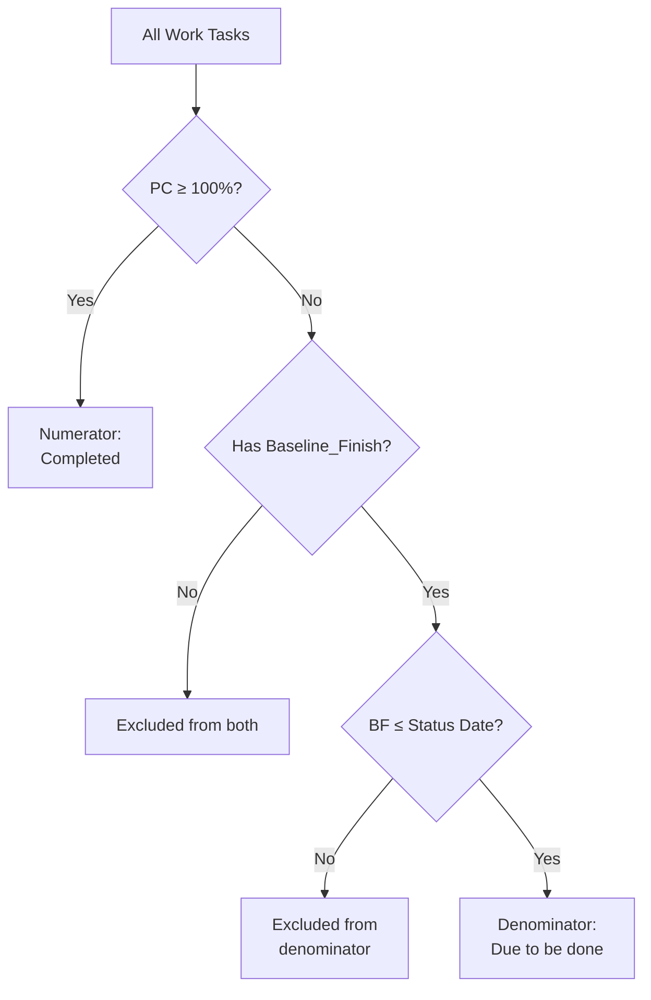
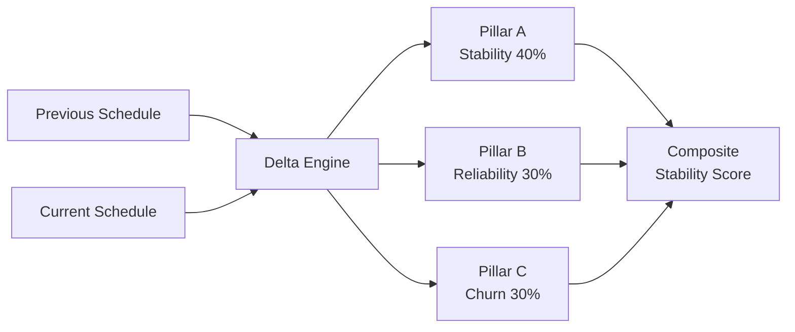

# ScheduleGate — User Manual

> **Audience:** Project managers, schedulers, and schedule analysts using Microsoft Project or compatible scheduling tools.
> **Version:** April 2026

---

## Table of Contents
1. [What This Tool Does](#1-what-this-tool-does)
2. [Installation](#2-installation)
3. [Quick Start](#3-quick-start)
4. [DCMA 14-Point Assessment Explained](#4-dcma-14-point-assessment-explained)
5. [The 14 Metrics in Detail](#5-the-14-metrics-in-detail)
6. [Schedule Comparison (Benchmarking)](#6-schedule-comparison-benchmarking)
7. [Command Reference](#7-command-reference)
8. [File Format and Column Requirements](#8-file-format-and-column-requirements)
9. [Key Assumptions and Methodology](#9-key-assumptions-and-methodology)
10. [Audit Evidence and Sources](#10-audit-evidence-and-sources)

---

## 1. What This Tool Does

The ScheduleGate evaluates the **health and quality** of an Integrated Master Schedule (IMS) exported from Microsoft Project or other scheduling tools.

It implements two primary analyses:

| Analysis | Purpose |
|----------|---------|
| **DCMA 14-Point Assessment** | Measures schedule quality against 14 standard checks defined by the Defense Contract Management Agency |
| **Schedule Comparison (Delta Engine)** | Benchmarks two schedule versions to measure stability, reliability, and scope churn |



---

## 2. Installation

### Prerequisites
- Go 1.21 or higher (for building from source)
- Microsoft Project export in `.xlsx` or `.csv` format

### Build from Source
```bash
git clone <repo>
cd schedulegate

# macOS / Linux
make build

# Windows cross-compile from macOS
make build-windows
```

Binary is placed in `bin/schedulegate` (or `.exe` for Windows).

---

## 3. Quick Start

```bash
# Run a full DCMA 14-point assessment with HTML report
./schedulegate assess my_schedule.xlsx --html report.html

# Validate that your file has all required columns
./schedulegate validate my_schedule.xlsx

# Compare two schedule versions
./schedulegate compare v1_schedule.xlsx v2_schedule.xlsx --html delta.html

# Run with a specific status date override
./schedulegate assess schedule.xlsx --status-date 2026-04-10
```

---

## 4. DCMA 14-Point Assessment Explained

### Background and Authority

The DCMA 14-Point Schedule Assessment is a standardized quality check developed by the **Defense Contract Management Agency (DCMA)** for use on defense contracts. It is formally defined in:

- **DCMA Instruction 209, Earned Value Management** — the DCMA policy framework
- **DCMA Program Assessment Tool Manual (PAM) 4.0** — detailed metric definitions and thresholds
- **DAU Acquipedia APMT-009** — authoritative formulas for BEI and related earned value metrics

The 14-point check is widely used beyond defense programs as an industry-standard schedule health benchmark. A high-quality schedule should pass all 14 metrics.

### Assessment Universe

Before any metric is calculated, the tool identifies the **assessment universe**: the set of tasks that are evaluated.



**Summary tasks** (rollup rows in MS Project) aggregate child tasks and have no independent logic. They are excluded from all denominators.

**Milestone tasks** have zero duration and represent key events. They are included in Logic and Missed Tasks but excluded from duration and float metrics.

### Status Date

The status date (also called "data date") is the reference point for all time-based metrics. It is determined in this priority order:

1. `--status-date` CLI flag (highest priority — user override)
2. Filename pattern `stMMDD` → MM/DD of current year (e.g., `st0410` → April 10)
3. Filename 5-digit `MDDYY` (e.g., `41026` → April 10, 2026)
4. Filename 8-digit `MMDDYYYY` or `YYYYMMDD`
5. `time.Now()` — today (fallback)

---

## 5. The 14 Metrics in Detail

### Metric 1 — Logic (Missing Predecessors/Successors)

**PAM Reference:** Section 4.1  
**Threshold:** 10%  
**Formula:** `Tasks without both a predecessor AND a successor / Total work tasks`

Every task in a well-formed schedule must be connected to the network. An open end (no predecessor or no successor) breaks critical path analysis and creates float anomalies.

**Exception:** The first task in the project may have no predecessor; the last task may have no successor. However, MS Project exports typically include project summary tasks that connect to all endpoints.

---

### Metric 2 — Leads (Negative Lag)

**PAM Reference:** Section 4.2  
**Threshold:** 5%  
**Formula:** `Relationships with negative lag / Total relationships`

A **lead** is a negative lag on a predecessor relationship, meaning the successor starts before the predecessor finishes. Leads are artificial schedule accelerations that make the schedule appear ahead of plan without actual work being accomplished.

> **PAM 4.2 verbatim:** *"Leads should not be used; therefore, the goal for this metric is 0."*

---

### Metric 3 — Lags

**PAM Reference:** Section 4.3  
**Threshold:** 10%  
**Formula:** `Relationships with positive lag / Total relationships`

A lag is a defined wait between tasks. While some lags are legitimate (cure time for concrete, procurement lead time), excessive use of lags can mask schedule risks.

---

### Metric 4 — Relationship Types (FS Ratio)

**PAM Reference:** Section 4.4  
**Threshold:** ≥ 90% must be Finish-to-Start  
**Formula:** `FS relationships / Total relationships`

Finish-to-Start (FS) is the standard relationship type — Task B cannot start until Task A finishes. Non-FS types (SS, FF, SF) create complex dependencies that are harder to analyze and often indicate schedule gaming.

---

### Metric 5 — Hard Constraints

**PAM Reference:** Section 4.5  
**Threshold:** < 5% of tasks  
**Formula:** `Tasks with hard constraints / Total work tasks`

**Hard constraints** prevent the schedule from adjusting to logic-driven dates:
- Must Finish On (MFO)
- Must Start On (MSO)
- Finish No Later Than (FNLT)
- Start No Later Than (SNLT)

Soft constraints (As Late As Possible, Finish No Earlier Than, etc.) are acceptable. Hard constraints override network logic and can hide float problems.

---

### Metric 6 — High Float

**PAM Reference:** Section 4.6  
**Threshold:** < 10% of work tasks  
**Formula:** `Tasks with Total Slack > 60 working days / Total work tasks`

60 working days ≈ 3 months. Tasks with excessive float often indicate missing logic connections (open ends) or artificial constraints.

---

### Metric 7 — Negative Float

**PAM Reference:** Section 4.7  
**Threshold:** < 5% of work tasks  
**Formula:** `Tasks with Total Slack < 0 / Total work tasks`

Negative float means a task is mathematically impossible to complete on time given the current network logic. It indicates schedule overcommitment or constraint violations.

---

### Metric 8 — High Duration

**PAM Reference:** Section 4.8  
**Threshold:** < 10% of work tasks  
**Formula:** `Tasks with Duration > 60 working days / Total work tasks`

Tasks longer than 60 working days (~3 months) are too long to track effectively. Long tasks make it difficult to identify slippage early and reduce the earned value measurement frequency.

---

### Metric 9 — Invalid Dates

**PAM Reference:** Section 4.9  
**Threshold:** 5%  
**Formula:** `Incomplete tasks with forecast finish date before status date / All work tasks`

This metric surfaces **schedule risk**: incomplete tasks whose current forecast finish is in the past. These tasks are already overdue according to the current schedule forecast and represent immediate execution issues.

> **Note:** This tool uses a risk-surfacing interpretation. Some tools use a narrower data-integrity interpretation (checking actual dates against status date). Both are defensible under PAM 4.9. See [Audit Evidence](#10-audit-evidence-and-sources) for details.

---

### Metric 10 — Resources

**PAM Reference:** Section 4.10  
**Threshold:** ≥ 95% of work tasks must have resources assigned  
**Formula:** `Tasks with at least one resource / Total work tasks`

> **PAM 4.10:** *"Some contractors may not load their resources into the IMS. The IMS DID does not require the contractor to load resources directly into the schedule."*

If no resource column exists in the export, this metric is marked **N/A** rather than 0% FAIL. This is the most accurate representation of the data.

---

### Metric 11 — Missed Tasks (Incomplete Tasks Past Due)

**PAM Reference:** Section 4.11  
**Threshold:** < 5% of baseline tasks  
**Formula:** `Incomplete work tasks with Baseline_Finish ≤ status date / All work tasks with Baseline_Finish ≤ status date`

**Baseline_Finish** is the originally planned finish date from Baseline 0. Tasks that were scheduled to finish by the status date but are not 100% complete are "missed."



---

### Metric 12 — Critical Path Test

**PAM Reference:** Section 4.12  
**Note:** Full test requires a live MS Project network (not possible from flat CSV)

The DCMA critical path test involves introducing an intentional delay into the critical path and verifying that the project finish date moves by the same amount. This requires active network calculation.

**Static proxy (this tool):** Passes if the schedule contains at least one task with Total Slack ≤ 0 (i.e., the critical path is defined). This is a minimum sanity check, not the full DCMA test.

---

### Metric 13 — CPLI (Critical Path Length Index)

**PAM Reference:** Section 4.13  
**Threshold:** ≥ 1.0  
**Formula:**

```
CPLI = (Critical Path Length + Total Float) / Critical Path Length
     = Remaining Critical Duration / (Remaining Critical Duration - Buffer Days)
```

CPLI measures how efficiently the schedule is tracking. A value below 0.95 indicates the schedule does not have sufficient float buffer to absorb typical execution variance.

---

### Metric 14 — BEI (Baseline Execution Index)

**PAM Reference:** DAU APMT-009  
**Threshold:** ≥ 0.95  
**Formula (authoritative):**

```
BEI = Completed Work Tasks / Work Tasks with Baseline_Finish ≤ Status Date
```

**Authority:** DAU Acquipedia APMT-009 — *"BEI = total tasks finished / tasks baselined to finish by status date"*



**Key rules:**
- **Numerator:** ALL completed work tasks count, regardless of when their baseline finish was
- **Denominator:** ONLY tasks where `Baseline_Finish` is set AND `Baseline_Finish ≤ DataDate`
- Tasks missing `Baseline_Finish` are excluded from both — they are not penalized

---

## 6. Schedule Comparison (Benchmarking)

The `compare` command takes two schedule versions and produces a **Stability Score (0–100)** built from three weighted pillars.



### Pillar A — Schedule Stability (40 pts)

Penalizes tasks where the finish date slipped by more than 2 days.

```
Penalty = (Weighted slipping tasks / Total tasks) × 100
Score A = max(0, 40 − Penalty)
```

Milestones carry **2× weight** because milestone slippage has disproportionate program impact.

### Pillar B — Duration Reliability (30 pts)

Penalizes tasks where duration grew by more than 10% (task "bloat").

```
Bloat % = (Count of bloated tasks / Total tasks) × 100
Penalty = Bloat % × 1.5
Score B = max(0, 30 − Penalty)
```

The 1.5× multiplier is intentionally harsh: if 20% of tasks bloat, the full 30 points are lost.

### Pillar C — Scope Churn (30 pts)

Penalizes task additions and deletions.

```
Churn % = ((New + Deleted) / Total tasks) × 100
Penalty = Churn % × 2.0
Score C = max(0, 30 − Penalty)
```

15% churn loses all 30 points.

### Ghost Tasks (Friction Index)

A **Ghost Task** is a task that should have started (planned start in the past) but has 0% progress. Ghost tasks are aggregated by WBS to identify which program phase is most "stuck."

### Task Symbology

| Symbol | Meaning | Pillar |
|--------|---------|--------|
| `⊕` | New task added | Churn |
| `×` | Task deleted | Churn |
| `☒` | Finish date slipped > 2 days | Stability |
| `←` | Finishing earlier than planned | Stability |
| `🐢` | Duration grew > 10% | Reliability |
| `👻` | Ghost task (past start, 0% done) | Reliability |
| `📝` | Minor changes | Neutral |
| `□` | Unchanged | Neutral |

---

## 7. Command Reference

### `assess` — DCMA 14-Point Assessment

```bash
./schedulegate assess <file> [flags]

Flags:
  -m, --metrics <1,5,12>      Run only specific metrics (comma-separated IDs 1-14)
      --html <path>            Generate HTML report
      --csv <path>             Append to CSV database (PowerBI-compatible)
      --exceptions-report <path> Generate Excel exceptions workbook (.xlsx)
      --customer <name>        Customer name for report header
      --project <id>           Project ID for report header
  -v, --verbose                Show raw numerator/denominator counts
      --status-date <date>     Override status date (YYYY-MM-DD, MM/DD/YYYY, MM/DD/YY)
      --debug-logic            Print per-task successor resolution trace
      --pct-format <format>    Percent complete scale: "0-100" (default) or "fraction"
      --date-locale <locale>   Date parsing priority: "US" (default) or "EU"
```

### `compare` — Schedule Delta Engine

```bash
./schedulegate compare <prev_file> <curr_file> [flags]

Flags:
      --html <path>            Generate HTML report
      --csv <path>             Append to CSV database
      --customer <name>        Customer name
      --project <id>           Project ID
      --detailed               Include task-level detail in HTML report
      --pct-format <format>    Percent complete scale: "0-100" (default) or "fraction"
      --date-locale <locale>   Date parsing priority: "US" (default) or "EU"
```

### `validate` — Column Validation

```bash
./schedulegate validate <file> [flags]

Flags:
      --html <path>           Generate HTML validation report
      --csv <path>            Append validation results to CSV

Output:
  READY       All required columns found
  INCOMPLETE  Missing required columns
```

### `check-patterns` — YAML Rule Compliance

```bash
./schedulegate check-patterns <file> --rules <rules.yaml> [flags]

Flags:
      --rules <path>           Path to YAML rules file (required)
      --html <path>            Generate HTML compliance report
      --csv <path>             Append results to CSV
      --detailed               Show matching task names per rule
      --pct-format <format>    Percent complete scale: "0-100" (default) or "fraction"
      --date-locale <locale>   Date parsing priority: "US" (default) or "EU"
```

**Rules file format:**
```yaml
rules:
  - name: "Mechanical Order Entry Tasks"
    match:
      name: "*Order Entry*"              # glob pattern, case-insensitive
      discipline: "05 - Mechanical"
    min_count: 1
    max_count: 50
    constraints:
      min_duration: 5
      max_duration: 30
```

---

## 8. File Format and Column Requirements

The tool reads schedule exports from Microsoft Project in `.xlsx` or `.csv` format. Column headers are matched **case-insensitively** with alias support.

### Required Columns (7 columns needed for core assessment)

| Canonical Name | Accepted Headers |
|----------------|-----------------|
| `task_id` | Task ID, ID, Task_ID, TaskID |
| `name` | Task Name, Name |
| `duration` | Duration, Dur, Original Duration |
| `start` | Start, Start Date |
| `finish` | Finish, Finish Date |
| `predecessors` | Predecessors, Pred |
| `percent_complete` | % Complete, Percent Complete, Percent_Complete |

> **Task ID vs Unique ID:** When a schedule export contains both a `Task ID` (or `ID`) column and a `Unique ID` column, the tool always uses `Task ID` so that exceptions report values match the row numbers visible in MS Project. `Unique ID` is stored separately and used only when no primary ID column is present.

### Optional Columns (enhance specific metrics)

| Canonical Name | Metrics | Accepted Headers |
|----------------|---------|-----------------|
| `unique_id` | — (stored, fallback ID) | Unique ID, UniqueID |
| `resources` | 10 — Resources | Resource Names, Resources |
| `wbs` | Friction Index | WBS, WBS Code |
| `constraint_type` | 5 — Hard Constraints | Constraint Type |
| `constraint_date` | 5 — Hard Constraints | Constraint Date |
| `total_slack` | 6, 7, 12, 13 | Total Slack, Total Float |
| `free_slack` | — (diagnostic) | Free Slack, Free Float |
| `finish_variance` | — (proxy for float/finish) | Finish Variance |
| `baseline_start` | 11, 14 | Baseline_Start, BL Start |
| `baseline_finish` | 11, 14 | Baseline_Finish, BL Finish |
| `baseline_duration` | 8 | Baseline_Duration, BL Duration |
| `actual_start` | 9 | Actual_Start, Actual Start |
| `actual_finish` | 9 | Actual_Finish, Actual Finish |
| `discipline` | Grouping / check-patterns | Task Discipline, Discipline |
| `mechanical_segment_nbr` | Grouping / check-patterns | Mechanical_Segment_Nbr, Mechanical Segment Nbr |
| `control_segment_nbr` | Grouping / check-patterns | Control_Segment_Nbr, Control Segment Nbr |
| `active` | Task filtering | Active |
| `summary` | Summary classification | Summary |
| `rollup` | Summary classification (fallback) | Rollup |
| `outline_level` | Hierarchy | Outline Level, Outline_Level |
| `constraint_date` | 5 — Hard Constraints detail | Constraint Date |

### Duration Format

MS Project exports durations in several formats, all handled automatically:

| Format | Example | Interpreted as |
|--------|---------|---------------|
| Days | `5d` | 5 working days |
| Weeks | `2w` | 10 working days (1w = 5 days) |
| No unit | `10` | 10 working days |
| Estimated | `5d?` | 5 working days (the `?` suffix is stripped) |
| Zero | `0d` or `0d?` | 0 days → milestone |

---

## 9. Key Assumptions and Methodology

### Task Classification

| Class | Criterion | Effect |
|-------|-----------|--------|
| Summary/Rollup | `Rollup == "Yes"` in CSV | Excluded from all metrics |
| Milestone | `Duration == 0` after parsing | Excluded from most metrics; included in Logic and Missed Tasks |
| Work Task | Non-summary AND non-milestone | Included in all metrics |

### Percent Complete

MS Project CSV exports `Percent_Complete` in the 0–1 range (e.g., `0.94` = 94%). The reader automatically detects this and scales to 0–100. The completion criterion is `PercentComplete ≥ 100`.

### BEI and Baseline Finish

The authoritative formula (DAU APMT-009) counts only tasks where `Baseline_Finish` is both present and ≤ status date in the denominator. Tasks missing `Baseline_Finish` are excluded from both numerator and denominator — they are not penalized.

### Invalid Dates — Risk-Surfacing Interpretation

This tool flags **incomplete work tasks whose current forecast finish date is in the past**. This is a broader, risk-surfacing interpretation: it surfaces tasks that the schedule currently predicts will miss their forecast. An alternate interpretation (data integrity: checking that actual dates are not after the status date) is narrower. The risk-surfacing approach is considered more actionable for project managers.

### Resources N/A

If no resource column is present in the schedule export, the Resources metric is reported as **N/A** rather than 0% FAIL. Per PAM 4.10, resource loading is not required by the IMS Data Item Description.

---

## 10. Audit Evidence and Sources

### Primary References

| Source | Document | Relevance |
|--------|----------|-----------|
| DCMA | Program Assessment Tool Manual (PAM) 4.0 | Threshold definitions for all 14 metrics |
| DAU | Acquipedia APMT-009 | BEI authoritative formula |
| DCMA | Instruction 209 | Earned Value Management policy |
| DCMA | Instruction 210 | Integrated Master Schedule policy |
| DAU | ACQuipedia — Integrated Master Schedule | IMS quality criteria |

### Threshold Summary Table

| # | Metric | PAM Threshold | Pass When |
|---|--------|--------------|-----------|
| 1 | Logic | 5% | < 5% of tasks with missing logic |
| 2 | Leads | 0% | Zero leads (negative lag) allowed |
| 3 | Lags | 10% | < 10% of relationships have lag |
| 4 | Relationship Types | ≥ 90% FS | ≥ 90% Finish-to-Start |
| 5 | Hard Constraints | < 5% | < 5% hard-constrained tasks |
| 6 | High Float | < 5% | < 5% tasks with slack > 44 days |
| 7 | Negative Float | < 5% | < 5% tasks with negative float |
| 8 | High Duration | < 10% | < 10% tasks with duration > 60 days |
| 9 | Invalid Dates | 0% | Zero invalid dates allowed |
| 10 | Resources | ≥ 95% | ≥ 95% tasks have resources |
| 11 | Missed Tasks | < 5% | < 5% of due tasks are incomplete |
| 12 | Critical Path Test | Pass/Fail | Critical path exists (static proxy) |
| 13 | CPLI | ≥ 1.0 | CPLI ≥ 1.0 |
| 14 | BEI | ≥ 0.95 | BEI ≥ 0.95 |

### Audit Trail

For a detailed comparison between this tool's results and an independent third-party assessment ([competitor tool]) on the Sample Project A st0410 schedule, see:

[docs/AUDIT_COMPARISON_GRAINGER_ST0410.md](docs/AUDIT_COMPARISON_GRAINGER_ST0410.md)

This document includes:
- Side-by-side metric comparison
- Methodology differences explained
- Bug fix documentation
- Policy rationale for each design decision
